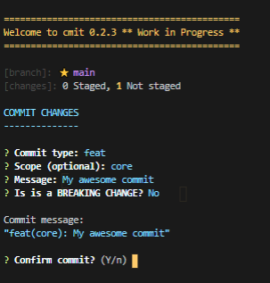

# cmit

A Git Commit CLI Utillity for conventional commits

### WORK IN PROGRESS

This project is not finished yet.

### What is CMIT?

The main goal for CMIT CLI is to encourage conventional commits for your project. It will provide an easy way to build the commit messages accourding to conventional commits, following a step by step proccess.

For more information about conventional commits, please visit:
www.conventionalcommits.org

Note that this project is still in development stage, and many core functionalities are not available yet.

### How to use it?

There are two ways to use CMIT:

#### 1. You can use it locally:

- install cmit for your project `yarn i cmit` or `npm i cmit`
- edit `package.json` and add: `cmit: "cmit"` on _scripts_ session
- run it with `yarn cmit` or `npm run cmit`

#### 2. You can use it globally:

- install cmit globally: `npm i cmit -g`
- on your project´s root folder, just run: `cmit`

### TODO:

- Pull / Push action
- Repeat last commit action
- Other Branch options (create / change)
- Display status summary
- Suggest default commit values by fetching branch name ('type/scope/msg')
- Cache and optimize git branch and status display
- Support local config file
